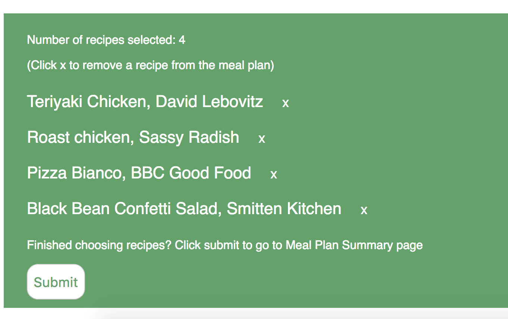
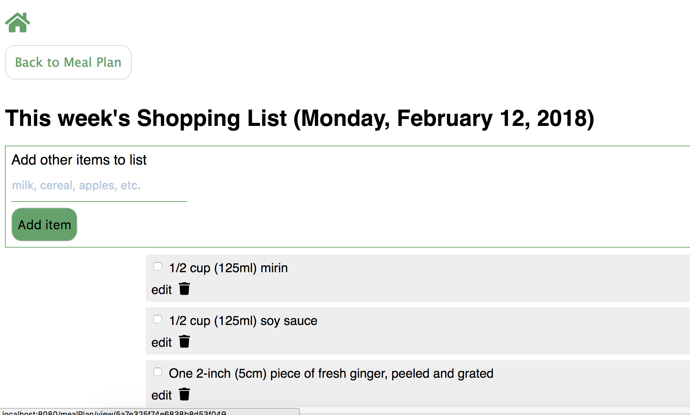

Imagine never again having to wonder what to make for dinner. All you need is a good plan! 

According to resources such as the Harvard School of Public Health (https://www.hsph.harvard.edu/nutritionsource/2017/03/20/meal-prep-planning/) and 
the Mayo Clinic (https://www.mayoclinic.org/healthy-lifestyle/nutrition-and-healthy-eating/in-depth/menu-planning/art-20048199), meal planning is a great way to make sure you're eating a balanced diet and meeting your nutritional needs. 
But we don't need experts to tell us what every busy, frugal home cook knows, that menu planning can save you time and money. With menu planning you know what your meals will look like and what you need to buy. 
That makes grocery shopping more efficient and cuts down on unplanned trips to buy one or two items. Who doesn't want less stress and less running around!

### EasyPeasy is here to help, in three easy steps

---
---

### Search the database for recipes by ingredient name (I used the Edamam API - https://developer.edamam.com/edamam-docs-recipe-api)

---
---

### Browse your results and add recipes to build your meal plan

---
---

### View your shopping list for the week
### You can add additional items (snacks, breakfast items, etc). And you can delete items you already have in your pantry (salt, etc.), as well as edit items for quantity, name brand, etc.

